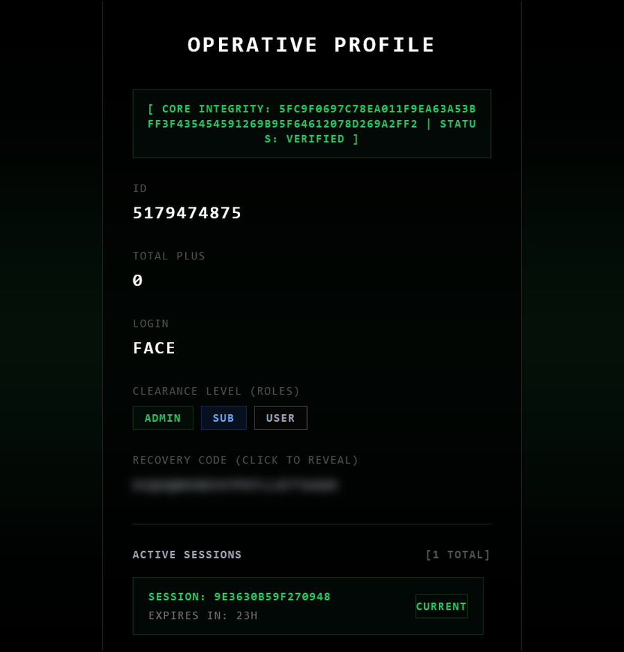
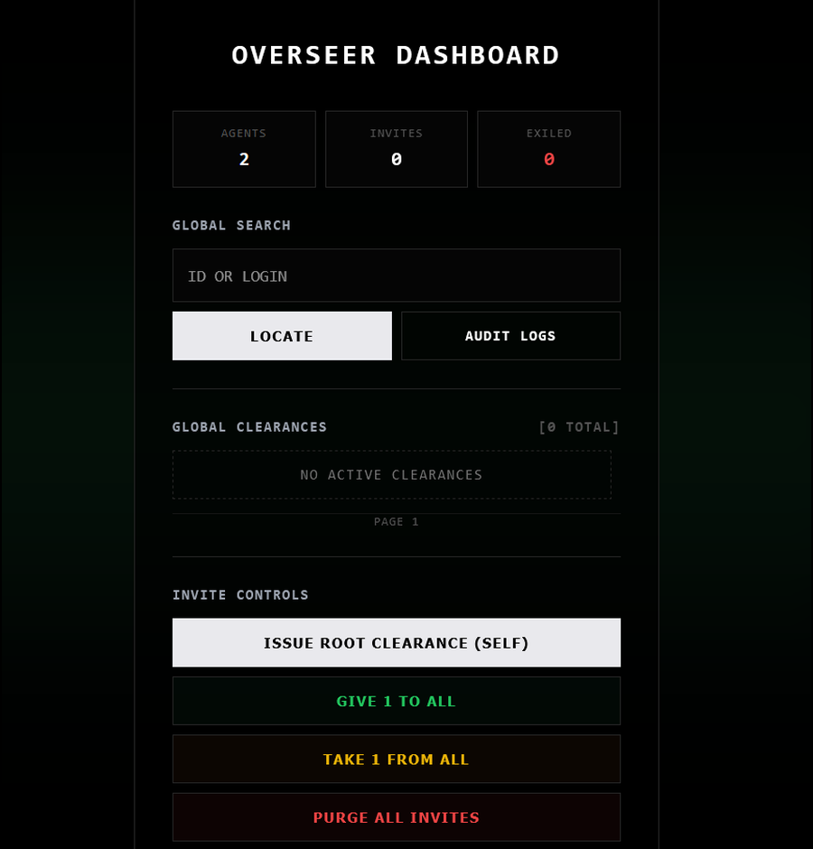
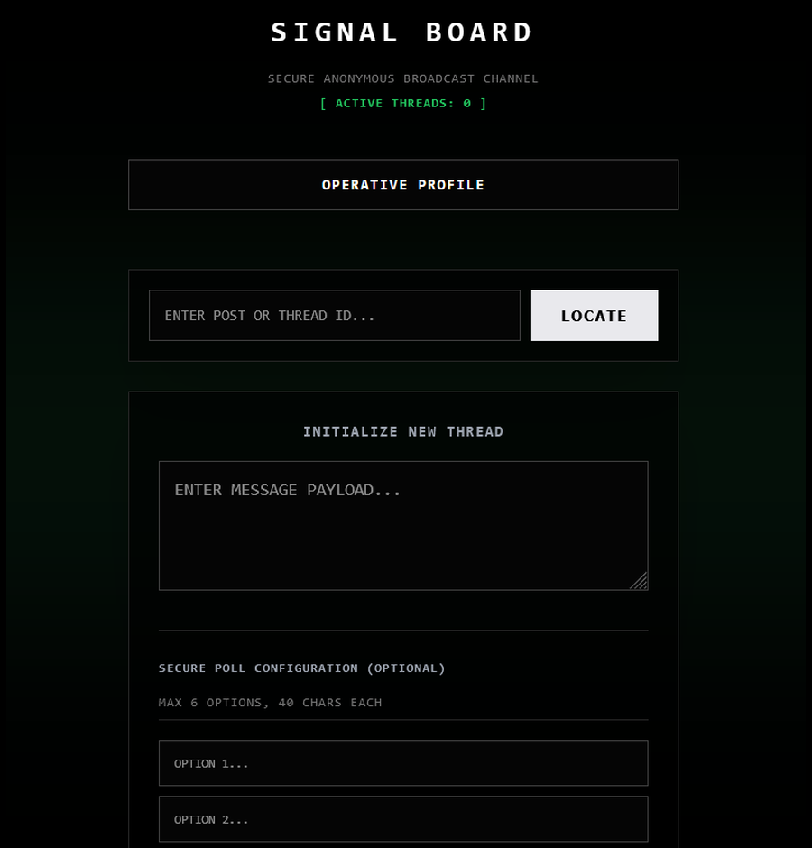

# SenseAim

Invite-only community app. Single binary, no external dependencies.

## Stack

- Rust 2024, Axum, Tokio
- Database: embedded `redb`, no separate DB server needed
- Templates: Askama, compiled straight into the binary
- Crypto: Argon2id for password hashing, Ed25519 for binary integrity checks
- No `unsafe` and no `unwrap`/`expect`, code passes `clippy::pedantic`

## Getting started

1. Build:

       cargo build --release

2. Generate the signature (creates `senseaim.sig`, the server won't start without it):

       ./target/release/signer

3. Run (on first launch it creates the DB tables and prints `MASTER INVITE` to the console):

       ./target/release/senseaim

## Screenshots

